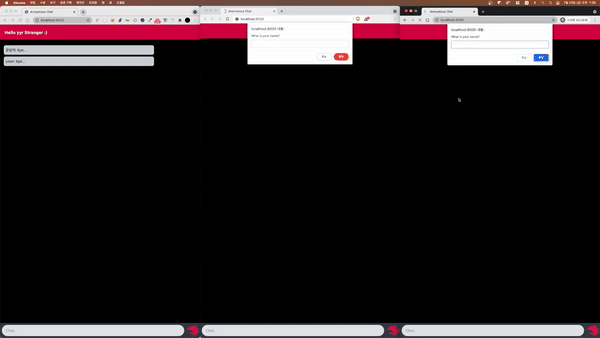

## Anonymous Realtime Chatting Room Based In NestJS Example

 

## Stack

- [NestJS](https://docs.nestjs.com/)
- [hbs](https://stackabuse.com/guide-to-handlebars-templating-engine-for-node)
- [socket.io](https://socket.io/docs/v3/emit-cheatsheet/index.html)
- [mongodb](https://docs.mongodb.com/manual/)
